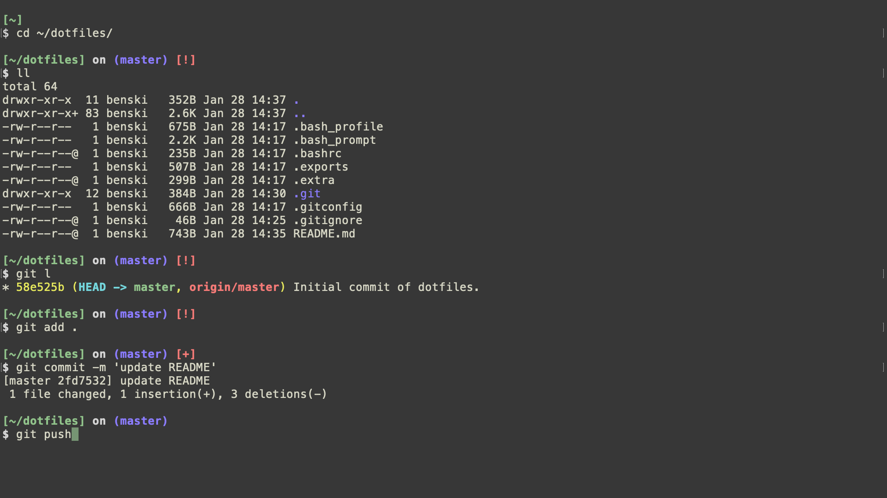

This repo contains the the dotfiles I use on my MacOS machine to make my life
easier. They are heavily influenced (read: cut and paste with changes)
by [Mathias Bynens' dotfiles
repo](https://github.com/mathiasbynens/dotfiles). Feel free to use
mine, but this repo is more for my personal use. See his if you want
_way_ more options.



## `.extra`

Not included in this repo is `.extra`, which sets up my personal git
identity. Right now, it looks like this:

```bash
# name
GIT_AUTHOR_NAME="<first name> <last name>"
GIT_COMMITTER_NAME="$GIT_AUTHOR_NAME"
git config --global user.name "$GIT_AUTHOR_NAME"

# email
GIT_AUTHOR_EMAIL="<email address>"
GIT_COMMITTER_EMAIL="$GIT_AUTHOR_EMAIL"
git config --global user.email "$GIT_AUTHOR_EMAIL"
```
